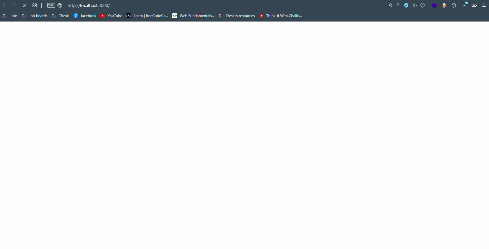

# Think-it Web Challenge: Gaming Charts - Junior 💥


## My personal information
**Full name:** Abdelhak RAHMOUNI <br>
**Email:** rahmouni.abdelhak.1@gmail.com <br>
**Phone-number:** +213 780 48 96 07 <br>
**website:** http://noisy96.github.io <br>
**Interview date:** 24/08/2021


## The problem
The goal is to create a SPA that enables the user to search for the top games by playtime or by number of unique users.

The application should consist of two components:

- A backend that serves the data to the frontend
- An SPA that consumes the endpoints exposed by the backend and displays the data to the user.

## Demo


## How to run
### from backend folder:
```
nodemon start
```
or
```
yarn start
```
or
```
npm start
```
The backend is set to run on port **3100** if no port is provided through environments variables

### from frontend folder:
```
yarn start
```
or
```
npm start
```

## Tests
### Implemented tests
- Test the root path response, it should return a welcome HTML page
- Test both endpoints `/select_top_by_playtime` and `/select_top_by_players`

## Frameworks
- [React](https://reactjs.org)
- [Express](https://expressjs.com)

## Libraries
- [Material UI](https://material-ui.com) components library (core, dataGrid, styles)
- [Cors](https://github.com/expressjs/cors)
- [Lodash](https://lodash.com)
- [Jest](https://jestjs.io)

## Tools
- VS Code
- Opera Browser

### Plugins
- [Prettier - Code formatter](https://prettier.io/)
- [REST Client](https://marketplace.visualstudio.com/items?itemName=humao.rest-client)